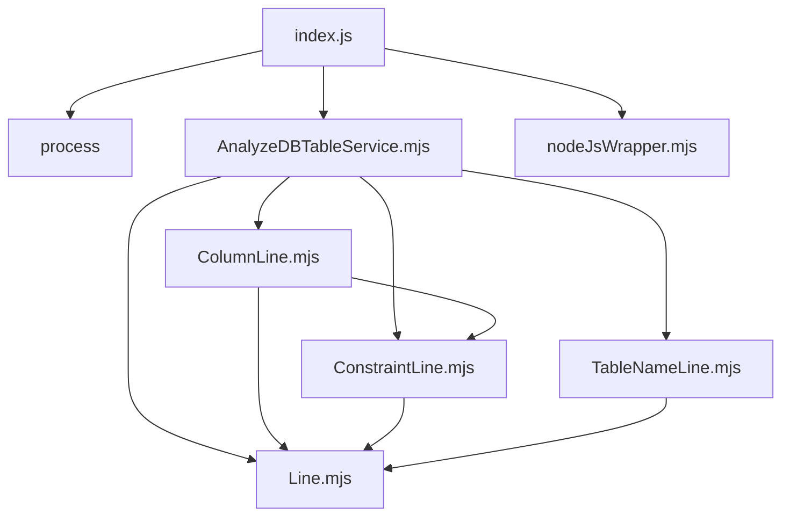

CREATE TABLE文からテーブル仕様書データを生成する
===
`find PATH | grep .sql`で取得したファイルをパースしてテーブル仕様のJSONを出力する

## usage
node . path/to/script > output.json

## 出力
```
[
  {
    "file": string, // スクリプトファイルのパス
    "table": { // テーブル情報
      "tableName": string, // テーブル名
      "tableNameComment": string, // テーブル名のコメント。なければ空文字
      "columns": [// カラム情報
        {
          "columnName": string, // カラム名
          "isPk": boolean,      // プライマリキーかどうか
          "isUnique": boolean,  // ユニークかどうか
          "type": string,       // 型
          "isNotNull": boolean, // NOT NULL制約の有無
          "comment": string     // カラムのコメント
        },...
      ]
    }
  },...
]
```

## 構成
